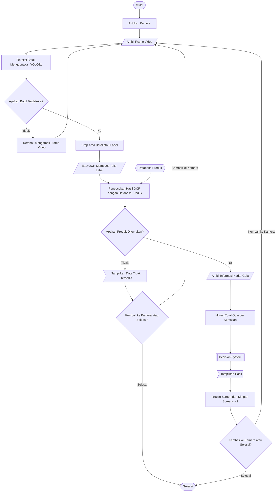

# YOLO11 + EasyOCR Beverage Sugar Detection

Sistem **computer vision** untuk mendeteksi botol minuman menggunakan **YOLO11**, membaca teks pada label dengan **EasyOCR**, mencocokkan hasil OCR ke database produk, lalu menampilkan informasi kadar gula dan kategori konsumsi melalui aplikasi desktop OpenCV maupun dashboard web Flask.

> Proyek penelitian: **Implementasi YOLO11 dan OCR untuk Identifikasi Botol Minuman serta Analisis Kadar Gula bagi Anak Berbasis Computer Vision**.

## Fitur Utama

- Deteksi botol minuman secara real-time menggunakan YOLO11.
- OCR label pada sudut `0°`, `90°`, `180°`, dan `270°`.
- OCR berjalan pada background thread agar video kamera tetap responsif.
- Normalisasi kesalahan pembacaan OCR, seperti `A8C`, `C0CA`, `G0LDA`, dan `FANT4`.
- Exact matching dan fuzzy matching terhadap database produk JSON.
- Informasi nama produk, kadar gula, status, confidence YOLO, dan match score.
- Freeze frame otomatis ketika produk berhasil dikenali.
- Screenshot hasil deteksi dan pencatatan riwayat ke file CSV.
- Dua mode penggunaan:
  - Aplikasi desktop melalui window OpenCV.
  - Dashboard web real-time berbasis Flask, MJPEG, dan Server-Sent Events.

## Alur Kerja Sistem



Proses utama sistem:

1. Memuat model YOLO dari `model/best.pt`.
2. Membuka webcam menggunakan OpenCV.
3. Mendeteksi objek botol pada setiap frame.
4. Memilih bounding box botol dengan confidence tertinggi.
5. Memotong area botol tanpa melewati batas frame.
6. Menjalankan EasyOCR pada crop asli dan hasil rotasi.
7. Memilih hasil OCR terbaik berdasarkan kata valid dan confidence.
8. Membersihkan teks melalui `ocr/text_cleaner.py`.
9. Mencocokkan teks dengan `database/beverages.json`.
10. Menampilkan hasil, menyimpan screenshot, dan menulis log CSV.

## Struktur Proyek

```text
.
├── config/
│   ├── __init__.py
│   └── settings.py              # Konfigurasi kamera, YOLO, OCR, dan web
├── database/
│   └── beverages.json           # Database produk, alias OCR, dan kadar gula
├── logs/                        # Log hasil deteksi dalam format CSV
├── model/
│   └── best.pt                  # Model YOLO11 hasil training
├── ocr/
│   ├── __init__.py
│   ├── reader.py                # Integrasi EasyOCR dan ProductMatcher
│   ├── text_cleaner.py          # Normalisasi dan pembersihan teks OCR
│   └── product_matcher.py       # Exact/fuzzy matching dan kategori gula
├── output/                      # Folder output tambahan
├── screenshot/                  # Screenshot otomatis hasil deteksi
├── utils/
│   ├── __init__.py
│   ├── display.py               # Bounding box, panel informasi, FPS, dan freeze
│   ├── logger.py                # Pencatatan deteksi ke CSV
│   └── screenshot.py            # Penyimpanan screenshot
├── web/
│   ├── index.html               # Struktur dashboard
│   ├── style.css                # Tampilan dashboard
│   └── script.js                # Live stream, SSE, statistik, dan riwayat
├── app.py                       # Backend dan dashboard Flask
├── detect.py                    # Aplikasi desktop OpenCV
├── requirements.txt
└── README.md
```

## Persyaratan

- Python 3.10 atau lebih baru.
- Webcam internal atau eksternal.
- Sistem operasi Windows, Linux, atau macOS.
- Pencahayaan yang cukup agar label minuman terbaca.

Dependensi utama:

- `ultralytics`
- `easyocr`
- `opencv-python`
- `numpy`
- `flask`

## Instalasi

### Windows PowerShell

```powershell
git clone https://github.com/Gslza/Yolo11-OCR_.git
cd Yolo11-OCR_

python -m venv .venv
.\.venv\Scripts\Activate.ps1
python -m pip install --upgrade pip
pip install -r requirements.txt
```

Apabila aktivasi virtual environment diblokir oleh PowerShell, jalankan:

```powershell
Set-ExecutionPolicy -Scope Process -ExecutionPolicy Bypass
.\.venv\Scripts\Activate.ps1
```

### Linux atau macOS

```bash
git clone https://github.com/Gslza/Yolo11-OCR_.git
cd Yolo11-OCR_

python3 -m venv .venv
source .venv/bin/activate
python -m pip install --upgrade pip
pip install -r requirements.txt
```

## Model YOLO11

Model yang digunakan berada pada:

```text
model/best.pt
```

Repository saat ini telah menyediakan file tersebut. Apabila model diganti, gunakan nama `best.pt` atau sesuaikan nilai `MODEL_PATH` pada `config/settings.py`.

## Menjalankan Program

### Mode Desktop OpenCV

```bash
python detect.py
```

Window OpenCV akan menampilkan video kamera, bounding box, FPS, teks OCR, nama produk, kadar gula, status, dan nilai confidence.

Tekan tombol `q` pada window OpenCV untuk menghentikan program.

### Mode Dashboard Web

```bash
python app.py
```

Buka alamat berikut melalui browser:

```text
http://localhost:5000
```

Dashboard menampilkan:

- Live camera feed.
- FPS dan status koneksi.
- Hasil deteksi aktif.
- Nama produk dan teks OCR.
- Confidence YOLO, sudut OCR, match score, dan match type.
- Gauge kadar gula.
- Statistik deteksi hari ini.
- Screenshot freeze frame.
- Riwayat 20 deteksi terbaru.

> Jangan menjalankan `detect.py` dan `app.py` secara bersamaan apabila keduanya menggunakan webcam yang sama.


## Konfigurasi

Pengaturan utama berada pada `config/settings.py`.

| Konfigurasi | Default | Keterangan |
| --- | ---: | --- |
| `MODEL_PATH` | `model/best.pt` | Lokasi model YOLO11 |
| `DATABASE_PATH` | `database/beverages.json` | Lokasi database produk |
| `CAMERA_INDEX` | `0` | Index webcam OpenCV |
| `FRAME_WIDTH` | `640` | Lebar frame kamera |
| `FRAME_HEIGHT` | `480` | Tinggi frame kamera |
| `CONFIDENCE_THRESHOLD` | `0.60` | Minimum confidence YOLO |
| `IOU_THRESHOLD` | `0.45` | Threshold IoU YOLO |
| `TARGET_CLASS_NAME` | `bottle` | Nama class target |
| `OCR_LANGUAGES` | `["en"]` | Bahasa EasyOCR |
| `OCR_GPU` | `False` | Menjalankan OCR menggunakan CPU |
| `OCR_MIN_CONFIDENCE` | `0.40` | Minimum confidence kata OCR |
| `OCR_ROTATION_ANGLES` | `[0, 90, 180, 270]` | Sudut pengujian OCR |
| `FUZZY_MATCH_THRESHOLD` | `0.72` | Ambang fuzzy matching |
| `DETECTION_COOLDOWN_SECONDS` | `3` | Jeda antarproses OCR |
| `FREEZE_DURATION_SECONDS` | `5` | Durasi freeze frame |
| `SCREENSHOT_ENABLED` | `True` | Mengaktifkan screenshot otomatis |
| `WEB_HOST` | `0.0.0.0` | Host server Flask |
| `WEB_PORT` | `5000` | Port dashboard |
| `STREAM_QUALITY` | `70` | Kualitas JPEG pada MJPEG stream |
| `MAX_HISTORY` | `50` | Batas riwayat dalam memori |

## Endpoint Dashboard

| Endpoint | Fungsi |
| --- | --- |
| `/` | Menampilkan halaman dashboard |
| `/video_feed` | Mengirim live stream MJPEG |
| `/events` | Mengirim status real-time melalui SSE |
| `/api/stats` | Mengambil statistik deteksi hari ini |
| `/api/history` | Mengambil 20 riwayat terbaru |
| `/screenshot/<filename>` | Menampilkan screenshot deteksi |

## Output Program

### Screenshot

Hasil pengenalan produk disimpan otomatis ke:

```text
screenshot/
```

### Log CSV

Riwayat deteksi disimpan ke:

```text
logs/detections_YYYYMMDD.csv
```

Data log mencakup timestamp, nama produk, teks OCR, kadar gula, status, confidence YOLO, match score, match type, dan lokasi screenshot.

## Optimasi Deteksi

Untuk memperoleh hasil yang lebih stabil:

1. Arahkan sisi label produk ke kamera.
2. Hindari pantulan cahaya langsung pada botol.
3. Gunakan latar belakang yang tidak terlalu ramai.
4. Tempatkan botol cukup dekat agar teks terlihat jelas.
5. Ubah `CAMERA_INDEX` apabila webcam yang terbuka bukan kamera yang diinginkan.
6. Naikkan `DETECTION_COOLDOWN_SECONDS` untuk mengurangi beban OCR.
7. Aktifkan `OCR_GPU` hanya jika lingkungan PyTorch dan GPU mendukungnya.


## Pengembang

**Gusli Yanza**  GitHub: [@Gslza](https://github.com/Gslza)
**Basuki Rahmat**  GitHub: [@Gslza](https://github.com/kazzuxy)
**Veryn Reviera Aiga**  GitHub: [@Gslza](https://github.com/Veryn7)
Program Studi Sistem Komputer  
